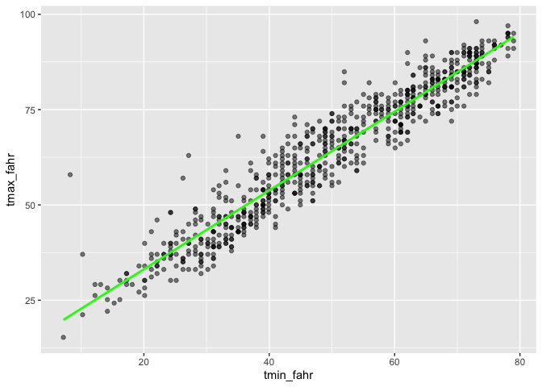
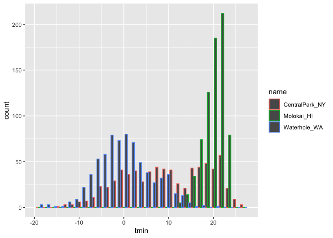

Visualization Lecture
================
Kaleb J. Frierson
2024-09-26

- [Lecture Notes](#lecture-notes)
- [Coding](#coding)
  - [libraries and setup](#libraries-and-setup)
  - [intro to ggplot](#intro-to-ggplot)
  - [Scatter plots](#scatter-plots)
  - [histograms](#histograms)
  - [box plots](#box-plots)
  - [saving and embedding plots](#saving-and-embedding-plots)

# Lecture Notes

Exploratory data analysis can mean a lot of things. You’re getting to
know your data! Everything you have done after importing and tidying
data up until you do official testing/analyses.

Looking at data is critical. You will make dozens of graphics for each
dataset. You will be the only person who views a lot of them. A small
subset are for others, but visualizing your data is crucial throughout
your work.

ggplot makes good graphics with relative ease (compared to base R
graphics). gg = grammar of graphics. Conceptual framework for how you
want to construct plots. Requires some learning about what that grammar
is. But once you know it, the infrastructure is the same.

Learning ggplot: lots of online materials. Google is helpful! David
Robinson: “Just discovered that I’ve visited this ggplot2 question 29
times in the last two years.”

Basic graph components: data, aesthetic mappings, geoms

Advanced graph components: facets, scales, statistics

A graph is built by combining these components. Components are
consistent across graph types!

# Coding

## libraries and setup

``` r
weather_df = 
  rnoaa::meteo_pull_monitors(
    c("USW00094728", "USW00022534", "USS0023B17S"),
    var = c("PRCP", "TMIN", "TMAX"), 
    date_min = "2021-01-01",
    date_max = "2022-12-31") |>
  mutate(
    name = case_match(
      id, 
      "USW00094728" ~ "CentralPark_NY", 
      "USW00022534" ~ "Molokai_HI",
      "USS0023B17S" ~ "Waterhole_WA"),
    tmin = tmin / 10,
    tmax = tmax / 10) |>
  select(name, id, everything())
```

    ## using cached file: /Users/kalebfrierson/Library/Caches/org.R-project.R/R/rnoaa/noaa_ghcnd/USW00094728.dly

    ## date created (size, mb): 2024-09-26 10:18:50.866904 (8.651)

    ## file min/max dates: 1869-01-01 / 2024-09-30

    ## using cached file: /Users/kalebfrierson/Library/Caches/org.R-project.R/R/rnoaa/noaa_ghcnd/USW00022534.dly

    ## date created (size, mb): 2024-09-26 10:19:03.825499 (3.932)

    ## file min/max dates: 1949-10-01 / 2024-09-30

    ## using cached file: /Users/kalebfrierson/Library/Caches/org.R-project.R/R/rnoaa/noaa_ghcnd/USS0023B17S.dly

    ## date created (size, mb): 2024-09-26 10:19:07.74187 (1.036)

    ## file min/max dates: 1999-09-01 / 2024-09-30

## intro to ggplot

``` r
weather_df
```

    ## # A tibble: 2,190 × 6
    ##    name           id          date        prcp  tmax  tmin
    ##    <chr>          <chr>       <date>     <dbl> <dbl> <dbl>
    ##  1 CentralPark_NY USW00094728 2021-01-01   157   4.4   0.6
    ##  2 CentralPark_NY USW00094728 2021-01-02    13  10.6   2.2
    ##  3 CentralPark_NY USW00094728 2021-01-03    56   3.3   1.1
    ##  4 CentralPark_NY USW00094728 2021-01-04     5   6.1   1.7
    ##  5 CentralPark_NY USW00094728 2021-01-05     0   5.6   2.2
    ##  6 CentralPark_NY USW00094728 2021-01-06     0   5     1.1
    ##  7 CentralPark_NY USW00094728 2021-01-07     0   5    -1  
    ##  8 CentralPark_NY USW00094728 2021-01-08     0   2.8  -2.7
    ##  9 CentralPark_NY USW00094728 2021-01-09     0   2.8  -4.3
    ## 10 CentralPark_NY USW00094728 2021-01-10     0   5    -1.6
    ## # ℹ 2,180 more rows

Making first plot, note that unless you assign geometry you won’t get
data on the plot.

``` r
ggp_weather_scatterplot = 
  ggplot(weather_df, aes(x = tmin, y = tmax)) +
  geom_point()

ggp_weather_scatterplot
```

    ## Warning: Removed 17 rows containing missing values or values outside the scale range
    ## (`geom_point()`).

<!-- -->

Alpha can change shading of points. Color by name adds a key. Geom
smooth fits a smooth line and defaults with standard error which you can
remove with SE = FALSE.

``` r
weather_df |> 
  ggplot(aes(x=tmin, y=tmax, color = name)) +
  geom_point(alpha = .3, size = .8) + 
  geom_smooth(se = FALSE)
```

    ## `geom_smooth()` using method = 'loess' and formula = 'y ~ x'

    ## Warning: Removed 17 rows containing non-finite outside the scale range
    ## (`stat_smooth()`).

    ## Warning: Removed 17 rows containing missing values or values outside the scale range
    ## (`geom_point()`).

<!-- -->

Where you define aesthetics matters:

``` r
weather_df |> 
  ggplot(aes(x=tmin, y=tmax)) +
  geom_point(aes(color = name), alpha = .3, size = .8) + 
  geom_smooth(se = FALSE)
```

    ## `geom_smooth()` using method = 'gam' and formula = 'y ~ s(x, bs = "cs")'

    ## Warning: Removed 17 rows containing non-finite outside the scale range
    ## (`stat_smooth()`).

    ## Warning: Removed 17 rows containing missing values or values outside the scale range
    ## (`geom_point()`).

<!-- -->

use faceting real quick:

``` r
weather_df |> 
  ggplot(aes(x=tmin, y=tmax, color = name)) + 
  geom_point(alpha=0.3) + 
  geom_smooth(se = FALSE) +
  facet_grid(. ~ name) #this is written such that columns are first, you can also do it the other way arounf (name ~ .)
```

    ## `geom_smooth()` using method = 'loess' and formula = 'y ~ x'

    ## Warning: Removed 17 rows containing non-finite outside the scale range
    ## (`stat_smooth()`).

    ## Warning: Removed 17 rows containing missing values or values outside the scale range
    ## (`geom_point()`).

<!-- -->

## Scatter plots

Let’s make a somewhat more interesting scatterplot:

``` r
weather_df |> 
  ggplot(aes(x= date, y= tmax, color = name, size = prcp)) + 
  geom_point(alpha = 0.3) + 
  geom_smooth(se = FALSE) + 
  facet_grid(.~name)
```

    ## Warning: Using `size` aesthetic for lines was deprecated in ggplot2 3.4.0.
    ## ℹ Please use `linewidth` instead.
    ## This warning is displayed once every 8 hours.
    ## Call `lifecycle::last_lifecycle_warnings()` to see where this warning was
    ## generated.

    ## `geom_smooth()` using method = 'loess' and formula = 'y ~ x'

    ## Warning: Removed 17 rows containing non-finite outside the scale range
    ## (`stat_smooth()`).

    ## Warning: The following aesthetics were dropped during statistical transformation: size.
    ## ℹ This can happen when ggplot fails to infer the correct grouping structure in
    ##   the data.
    ## ℹ Did you forget to specify a `group` aesthetic or to convert a numerical
    ##   variable into a factor?
    ## The following aesthetics were dropped during statistical transformation: size.
    ## ℹ This can happen when ggplot fails to infer the correct grouping structure in
    ##   the data.
    ## ℹ Did you forget to specify a `group` aesthetic or to convert a numerical
    ##   variable into a factor?
    ## The following aesthetics were dropped during statistical transformation: size.
    ## ℹ This can happen when ggplot fails to infer the correct grouping structure in
    ##   the data.
    ## ℹ Did you forget to specify a `group` aesthetic or to convert a numerical
    ##   variable into a factor?

    ## Warning: Removed 19 rows containing missing values or values outside the scale range
    ## (`geom_point()`).

<!-- -->

``` r
weather_df |> 
  filter(name == "CentralPark_NY") |> 
  mutate(
    tmax_fahr = tmax * (9 / 5) + 32,
    tmin_fahr = tmin * (9 / 5) + 32) |> 
  ggplot(aes(x = tmin_fahr, y = tmax_fahr)) +
  geom_point(alpha = .5) + 
  geom_smooth(method = "lm", se = FALSE, color = "green")
```

    ## `geom_smooth()` using formula = 'y ~ x'

<!-- -->
\## Small things

``` r
weather_df |> 
  ggplot(aes(x=tmin, y=tmax))+
  geom_point(aes(color = name), alpha = .3, size= .8) + 
  geom_smooth(se = FALSE)
```

    ## `geom_smooth()` using method = 'gam' and formula = 'y ~ s(x, bs = "cs")'

    ## Warning: Removed 17 rows containing non-finite outside the scale range
    ## (`stat_smooth()`).

    ## Warning: Removed 17 rows containing missing values or values outside the scale range
    ## (`geom_point()`).

<!-- -->

``` r
weather_df |> 
  ggplot(aes(x=tmin, y=tmax))+
  geom_hex()
```

    ## Warning: Removed 17 rows containing non-finite outside the scale range
    ## (`stat_binhex()`).

<!-- -->

``` r
weather_df |> 
  ggplot(aes(x= tmin, y=tmax)) +
  geom_point(color = "royalblue")
```

    ## Warning: Removed 17 rows containing missing values or values outside the scale range
    ## (`geom_point()`).

<!-- -->

Colors bring up a great question. When to quote and when not to quote?

Generally speaking, if something is a variable name, it doesn’t need to
be in quotes. If it is NOT a variable name it often needs quotes. Unless
of course it is a function.

## histograms

color defines the outside of the histogram bar, fill will fill the bar.
It is still difficult to compare these things. You can say in histogram
position = dodge and it will put bars next to eachother instead of on
top of eachother.

``` r
weather_df |> 
  ggplot(aes(x=tmin, color = name)) + 
  geom_histogram(position="dodge")
```

    ## `stat_bin()` using `bins = 30`. Pick better value with `binwidth`.

    ## Warning: Removed 17 rows containing non-finite outside the scale range
    ## (`stat_bin()`).

<!-- -->
Still difficult to see, how to fix? Useing facet?

``` r
weather_df |> 
  ggplot(aes(x=tmin, fill=name)) + 
  geom_histogram()+
  facet_grid(.~name)
```

    ## `stat_bin()` using `bins = 30`. Pick better value with `binwidth`.

    ## Warning: Removed 17 rows containing non-finite outside the scale range
    ## (`stat_bin()`).

<!-- -->

This is kind of clunky. Maybe not the best way to compare the data.
Great for seeing distributions.

Density plot? Get a more “smooth” histogram. Helps make comparisons and
see the distributions.

``` r
weather_df |> 
  ggplot(aes(x=tmin, fill = name))+
  geom_density(alpha = 0.3)
```

    ## Warning: Removed 17 rows containing non-finite outside the scale range
    ## (`stat_density()`).

<!-- -->

## box plots

Color not appropriate here for identifying but might help for
consistency if you decide to report these graphs or you just like pretty
colors:

``` r
weather_df |> 
  ggplot(aes(x=name, y=tmin, fill = name)) + 
  geom_boxplot()
```

    ## Warning: Removed 17 rows containing non-finite outside the scale range
    ## (`stat_boxplot()`).

<!-- -->
\## violin plots

``` r
weather_df |> 
  ggplot(aes(x=name, y=tmin, fill = name)) + 
  geom_violin()
```

    ## Warning: Removed 17 rows containing non-finite outside the scale range
    ## (`stat_ydensity()`).

<!-- -->
\## ridge plots

didn’t exist and then in 2017 they went crazy

``` r
weather_df |> 
  ggplot(aes(x=tmin, y= name)) + 
  geom_density_ridges()
```

    ## Picking joint bandwidth of 1.41

    ## Warning: Removed 17 rows containing non-finite outside the scale range
    ## (`stat_density_ridges()`).

<!-- -->
\## Learning assessment

``` r
ggplot(weather_df, aes(x = prcp)) + 
  geom_density(aes(fill = name), alpha = .5) 
```

    ## Warning: Removed 15 rows containing non-finite outside the scale range
    ## (`stat_density()`).

<!-- -->

``` r
ggplot(weather_df, aes(x = prcp, y = name)) + 
  geom_density_ridges(scale = .85)
```

    ## Picking joint bandwidth of 9.22

    ## Warning: Removed 15 rows containing non-finite outside the scale range
    ## (`stat_density_ridges()`).

<!-- -->

``` r
ggplot(weather_df, aes(y = prcp, x = name)) + 
  geom_boxplot() 
```

    ## Warning: Removed 15 rows containing non-finite outside the scale range
    ## (`stat_boxplot()`).

<!-- -->

``` r
weather_df |> 
  ggplot(aes(x=name, y=prcp, fill = name)) + 
  geom_violin()
```

    ## Warning: Removed 15 rows containing non-finite outside the scale range
    ## (`stat_ydensity()`).

<!-- -->

Lots of days there is no rain, lets filter to make graphics better:

``` r
weather_df |> 
  filter(prcp > 0) |> 
  ggplot(aes(x = prcp, y = name)) + 
  geom_density_ridges(scale = .85)
```

    ## Picking joint bandwidth of 20.6

<!-- -->

``` r
weather_df |> 
  filter(prcp > 10) |> 
  ggplot(aes(x = prcp, y = name)) + 
  geom_density_ridges(scale = .85)
```

    ## Picking joint bandwidth of 31.8

<!-- -->

What if you have one outlier that is really stretching you axis? Take it
out if you want!

## saving and embedding plots

``` r
ggp_weather= 
  weather_df |> 
  ggplot(aes(x= date, y = tmax, color = name)) + 
  geom_point() 

ggsave("plots/ggp_weather.pdf", ggp_weather, width = 8, height = 6)
```

``` r
  weather_df |> 
  ggplot(aes(x= date, y = tmax, color = name)) + 
  geom_point() 
```

    ## Warning: Removed 17 rows containing missing values or values outside the scale range
    ## (`geom_point()`).

<!-- -->
